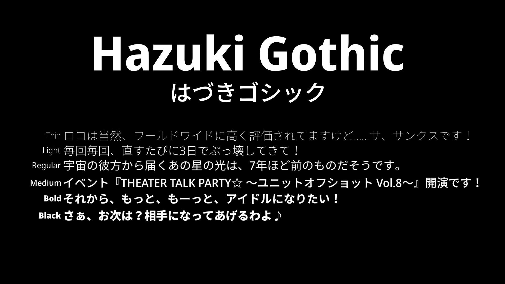

# Hazuki Gothic (はづきゴシック)
Hazuki Gothic is a basic san serif (Gothic) font family based on Noto Sans Display and Noto Sans CJK JP. Latin, Greek, and Cyrillic glyphs are from Noto Sans Display, while Japanese glyphs are from Noto Sans JP. It has Thin, Light, Regular, Medium, Bold, and Black styles and is hinted.

This font is released under the SIL Open Font License (OFL) v1.1, which allows you to copy, modify, and redistribute them if you need to. Refer to [this link](http://scripts.sil.org/OFL) for exact details on what the conditions and restrictions are.

『はづきゴシック』は「Noto Sans Display」と「Noto Sans CJK JP」を基に作られた基本的なサンセリフフォント（ゴシック）です。はづきゴシックは、「Noto Sans Display」と「Noto Sans CJK JP」を基にした日本語の基本的なサンセリフ（ゴシック）体である。ラテン文字、ギリシャ文字、キリル文字は「Noto Sans Display」から、日本文字は「Noto Sans JP」から使用されています。このフォントのウエイトは、Thin、Light、Regular、Medium、Bold、Blackの6種類。

このフォントは、SIL Open Font License (OFL) v1.1の下でリリースされており、必要に応じてコピー、変更、再配布が可能です。条件や制限についての正確な詳細は、[このリンク](http://scripts.sil.org/OFL)をご確認ください。

Noto Sans Display™& ©Google Inc. 2015-2021 ALL RIGHTS RESERVED.

Noto Sans CJK™& ©Adobe Systems Incorporated 2014-2021 ALL RIGHTS RESERVED.
